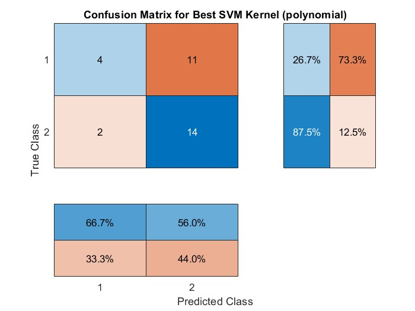
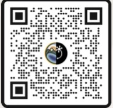

# EEG-Based-Classification-of-Motor-Imagery-and-Movement-Across-Brain-Regions
This study aims to enhance comprehension of brain activity during both imagined and actual motions, using this knowledge to inform neurorehabilitation strategies for individuals with movement impairments.

# Motor Imagery EEG Signal Classification (BCI) 

This project focuses on the analysis and classification of EEG signals for Motor Imagery Brain-Computer Interface (BCI). The study processes multi-channel EEG data to distinguish between different motor imagery tasks.

## 📊 Project Overview
* **Data Source:** Secondary analysis of the GigaScience Database (Cho et al., 2017).
* **Scope:** Comprehensive analysis of 52 individual subjects.
* **Tools:** Developed and implemented using **MATLAB**.
* **Key Features:** Signal preprocessing, feature extraction, and classification using SVM (Support Vector Machine).

## 📁 Repository Structure
- `/code`: Contains the main MATLAB scripts for signal processing and classification.
- `/data`: Information and links to the original 52-case dataset.
- `/images`: Visualization of results, including confusion matrices and performance metrics.
- `/article`: Pre-print/information regarding the related research paper.

## 📈 Results
The classification performance was evaluated using various kernels. Below is the confusion matrix for the best-performing SVM model:

*(Note: A colorblind-friendly version of all figures is available in the `(Figures/Colorblind-friendly)` directory.)*

## 🛠 How to Use
1. **Data:** Download the raw files from the link provided in the `/Data` folder.
2. **Run:** Execute the `Maincode.m` script in MATLAB to reproduce the results.

## 📜 License
This project is licensed under the MIT License - see the LICENSE file for details.

---
## 📄 Access the Full Paper
You can access the full research paper related to this project through the link or QR code below:

🔗 **[Click here to read the full article](https://zenodo.org/records/15315501)**

